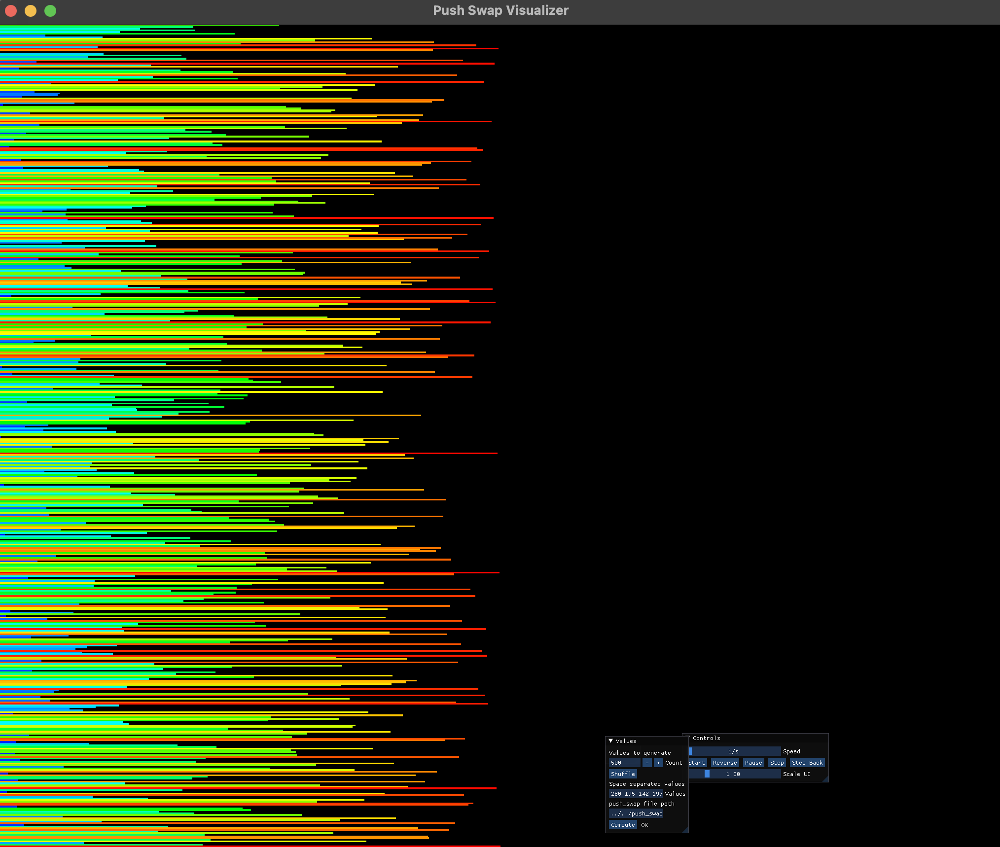
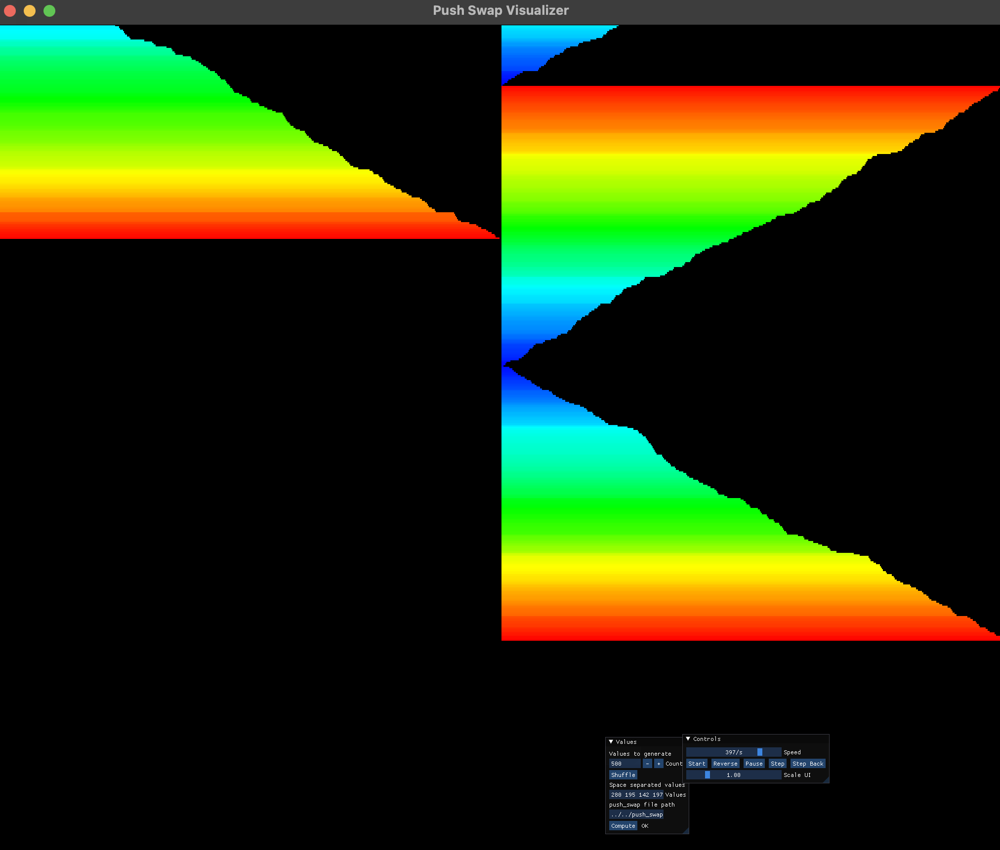
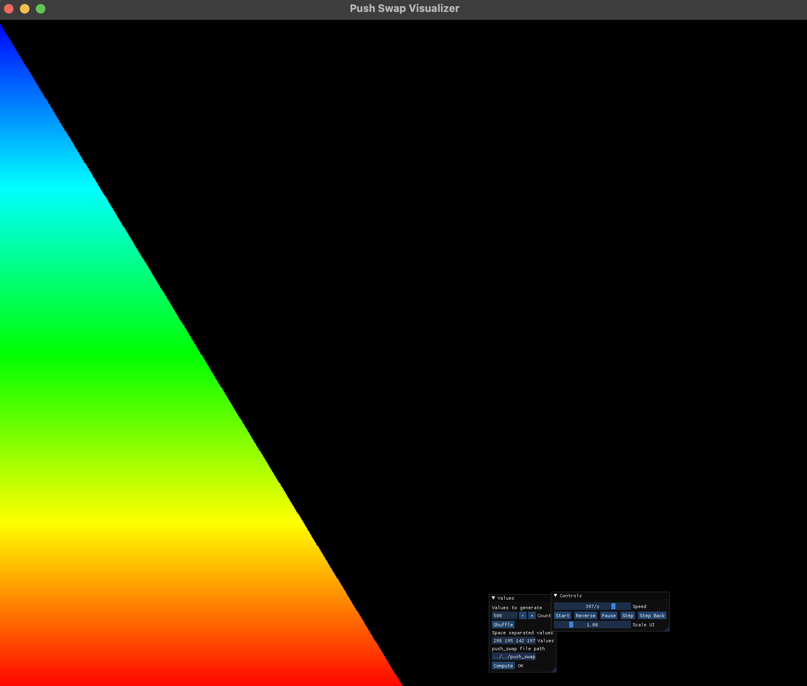

> # 📶 push_swap

두개의 스택, 정렬해야하는 수, 스택을 조작하는 명령어 집합이 주어젔을 때
연속된 숫자들을 최소한의 명령어를 사용하여 정렬하는 알고리즘 구현

## ✅ Mandatory part

스택 두개(a, b)를 사용한다

- 스택 a는 랜덤한 정수로 가득 차 있다.
- 스택 b는 비어 있다.

목표는 스택 a의 정수를 오름차순으로 정렬하는 것이다.

사용할 수 있는 명령어

- `sa`: 스택 a의 top에 위치한 두 요소의 순서를 바꾼다.
- `sb`: 스택 b의 top에 위치한 두 요소의 순서를 바꾼다.
- `ss`: sa와 sb를 동시에 실행한다.
- `pa`: 스택 b의 top 요소를 스택 a의 top으로 옮긴다. (스택 b에서 a로 push)
- `pb`: 스택 a의 top 요소를 스택 b의 top으로 옮긴다. (스택 a에서 b로 push)
- `ra`: 스택 a의 첫 번째 요소가 맨 마지막으로 이동하고, 나머지 요소들이 한 칸씩 위로 이동한다.
- `rb`: 스택 b의 첫 번째 요소가 맨 마지막으로 이동하고, 나머지 요소들이 한 칸씩 위로 이동한다.
- `rr`: ra와 rb를 동시에 실행한다.
- `rra`: 스택 a의 마지막 원소가 맨 위로 이동하고, 나머지 원소들이 한 칸씩 아래로 이동한다.
- `rrb`: 스택 b의 마지막 원소가 맨 위로 이동하고, 나머지 원소들이 한 칸씩 아래로 이동한다.
- `rrr`: rra와 rrb를 동시에 실행한다.

<br>

## ✅ Bonus part

push_swap 명령어의 결과를 검증하는 checker 프로그램 만들기

- `checker`는 명령어가 주어졌을 때, 스택이 올바르게 정렬되었는지 확인하는 역할을 한다.
- `OK`가 출력되면 스택이 올바르게 정렬된 것이고, `KO`가 출력되면 정렬에 실패한 것이다.

<br>

## ⌨️ 실행 방법

1. 프로그램 설치 및 루트 디렉토리로 이동

```shell
git clone https://github.com/GCgang/push_swap.git && cd push_swap
```

2. 프로그램 컴파일

   push_swap 프로그램 컴파일

   ```shell
   make
   ```

   checker 프로그램 컴파일

   ```shell
   make bonus
   ```

3. push_swap 프로그램 실행

```shell
./push_swap [정수 목록]
```

- 예시: `./push_swap 5 4 3 2 1`

- 이 명령어는 스택 a에 숫자들을 넣고, 이를 정렬하기 위한 효율적인 명령어 목록을 출력.

4. checker 프로그램 실행

```shell
ARG="3 0 9 2 -1"; ./push_swap $ARG | ./checker $ARG
```

- push_swap이 출력한 결과를 checker로 검증합니다.

  <br>

## 🏅 정렬 성능 점수

프로그램의 정렬 성능은 다음 기준에 따라 평가된다.

### 100개의 랜덤 숫자 정렬

- 700번 이하의 동작: **5점**
- 900번 이하의 동작: **4점**
- 1100번 이하의 동작: **3점**
- 1300번 이하의 동작: **2점**
- 1500번 이하의 동작: **1점**

### 500개의 랜덤 숫자 정렬

- 5500번 이하의 동작: **5점**
- 7000번 이하의 동작: **4점**
- 8500번 이하의 동작: **3점**
- 10000번 이하의 동작: **2점**
- 11500번 이하의 동작: **1점**

### 성능 테스트 방법

100개의 랜덤 숫자 테스트하기

```shell
ARG=$(ruby -e "puts (1..100).to_a.shuffle.join(' ')"); ./push_swap $ARG | wc -l
```

500개의 랜덤 숫자 테스트하기

```shell
ARG=$(ruby -e "puts (1..500).to_a.shuffle.join(' ')"); ./push_swap $ARG | wc -l
```

<br>

## ✏️ Review

- 과제에서 사용할 자료구조를 정하기 위해 스택과 덱, 연결리스트에 대해 학습하고 사용하는 과정에서 각 자료구조를 이해하는데 많은 도움이 되었습니다.
- 과제에서 어떤 정렬 알고리즘을 적용시키면 좋을지 고민하며 선택정렬, 버블정렬, 퀵 정렬, 삽입 정렬, 셀 정렬, 병합 정렬, 기수 정렬, 힙 정렬 등 여러가지 정렬 알고리즘들을 배울 수 있었습니다.
- 사용자 입력에 대한 에러처리를 고민하며 구현 했습니다.
- 메모리 누수가 발생하지 않도록 메모리 관리를 신경쓰며 구현 했습니다.

<br>

## 📊 Push Swap Visualizer





- Push Swap의 동작을 시각적으로 확인하고 싶다면 [Push Swap Visualizer](https://github.com/o-reo/push_swap_visualizer)를 사용할 수 있다.
